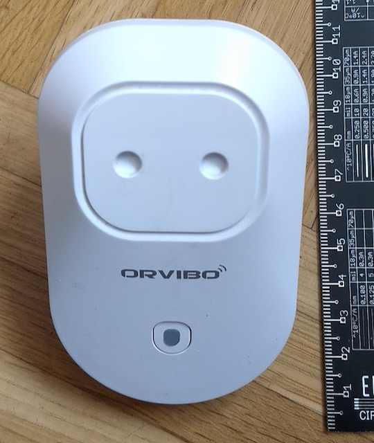
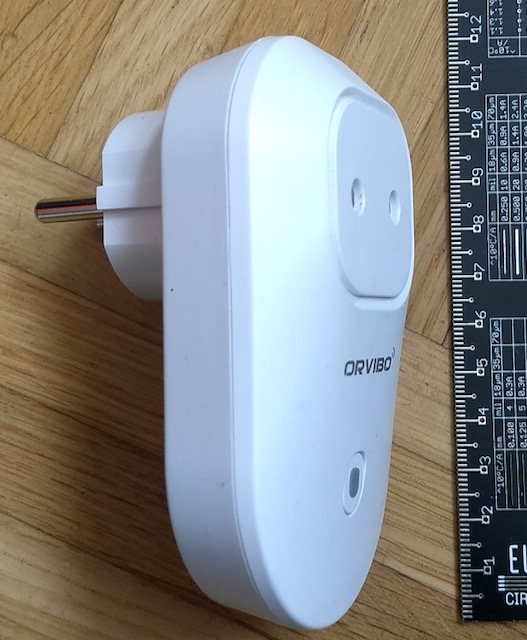
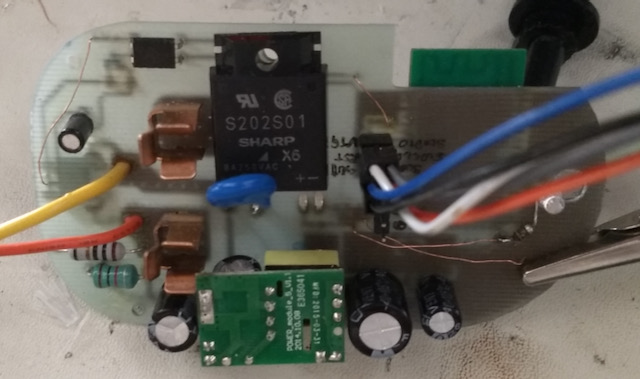
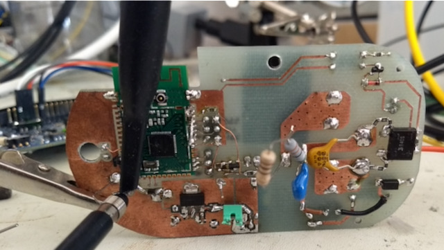
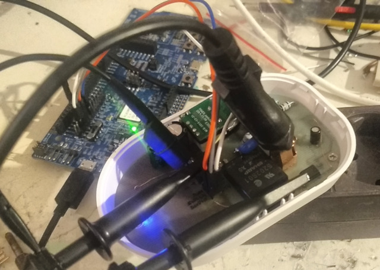
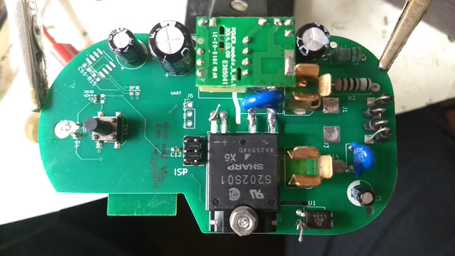
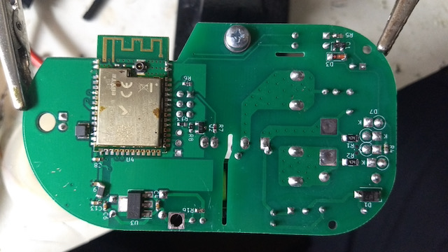

## SturmFront

SturmFront is a DIY fan-controller for indoor sports, which adjusts fan speed according to your current heart rate.

I use while riding Zwift. The advantages:

* **Never forget to turn on your fan.** SturmFront turns on your fan automatically.
* **Never freeze your butt off during warming up.** SturmFront adjusts the fan speed to your current heart rate. Low heart rate means the fan spins slowly or is even off.
* **Auto-adjusts during the ride.** No weird acrobatics during a ride or race to adjust your fan speed. Your fan already has adjustable speed, but it is almost out of reach? You have to lean awkwardly towards your fan, risking falling off your bike?
* **Never freeze during cooldown.** Ride, race or workout is over? Especially in autumn or winter I was freezing if my fan was still going full blast.

## Alternatives

I developed SturmFront as a low-cost, DIY-version of the well-known Wahoo® KICKR Headwind. In contrast to the KICKR Headwind, SturmFront does not have an integrated fan, but can be thought of like a smart plug, but instead of WiFi it uses ANT+ and instead of simply on/off-control SturmFront offers adjustable power output. This allows SturmFront to turn any fan into a smart fan.
Keith Wakeham developed also a DIY fan controller named [Maelstom](https://github.com/kwakeham/Maelstrom).

## Function

A short, probably not complete description of how SturmFront works.

### Hardware

As basis for SturmFront I used a second-hand WiFi-enabled smart socket from the local classifieds. It cost me only 2,50€ and I got a living room suitable enclosure as well as the proper power socket connectors:

  
  

I also re-used the components from the power supply. I couldn't re-use the SoC and/or WiFi chip, beacuse I needed ANT+ and Bluetooth connectivity. The electro-mechanical relay was also not of any use to me, because I needed phase control to be able to adjust the fan's speed.

Before ordering a manufactured PCB, I isolation-milled an engineering prototype:

  
  

Since the PCB is oddly-shaped with large radii all around plus a button, LED and screw holes all of whose locations have to match with the case, having a prototype allowed me to check all dimensions before ordering as well as to check if all components would still fit in the case height-wise. I was also able to check for errors and improvements in the PCB design. Lastly, I was able to polish the firmware before the final boards arrived.

  

Note, that the outlet in the picture is not connected to mains, but to an isolation transformer for testing.

Making a prototype turned out to be a good decision, since I found multiple errors in the PCB which I had fixed for the final, professionally manufactured PCB. I still managed to sneak a few issues in the final PCB. For example, the silkscreen of the pinout labels of the ISP-connector are hidden underneath the SSR. 😅

  
  

### Software

During development and testing of SturmFront it soon became obvious to me that speed control linearly proportinal to heart rate is insufficient.
- First, I added a temperature input to the control software to compensate for colder air temperatures in winter and/or when my window is open. Temperature can be adjusted 5˚K intervals.
- Second, instead of linearly mapping the heart rate to control the SSR, fan speed can now be adjusted 5 bpm increments.

SturmFront uses bilinear mapping to interpolate between 5˚K and 5 bpm values.

